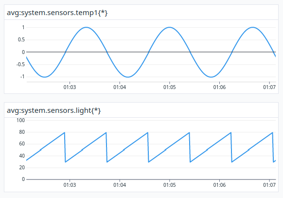

# gobarebones v0.1

# Warning: W.I.P., do not use

A stripped down and embeddable implementation of a DataDog agent in golang that
is extremely easy to set up and use. You need an API key and the correct hostname
for your region (look in config/env.go for an hardcoded list).

This package is meant to be simple and was made just for the sake of it so, again,
DO NOT USE IT yet, especially in production.

The objectives of this little library:

1. Have no dependencies except for the std lib
2. Just push metrics and logs, nothing else
3. Do some optimizations to keep it all very lightweight

TODO:
- [ ] Logs
- [x] Agent
- [x] Refactor
- [x] Metrics
- [ ] Testing

## How to run the example

Go to example/ and add a config.json file like this:

    {
        "Region": "https://datadoghq.eu",
        "APIKey": "xxxxxxxxxxxxxxxxxxxxxxxxxxxxxxxx"
    }

go run example/main.go

Log in into DataDog, go to Metrics -> Summary. You should see two new metrics:

    system.sensors.temp1
    system.sensors.light
    
Now export the metrics into a test dashboard.

